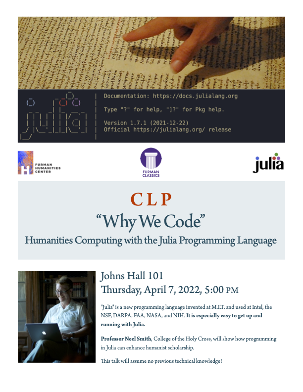

# Why we code: public talk and weekend workshop

## Who

Anyone from student to senior scholar is welcome to join us, especially if any of these describe you:

- interested in or sceptical about how coding can provoke thinking about language and literature
- no programming background, but would like the chance to get hands-on experience in the context of humanities studies
- have some previous programming experience, but curious about Julia
- coming from outside the humanities and wonder why my friends and colleagues who study humanities would write code

## What

- Public talk followed by discussion (Thursday, April 7: poster below)

Overviews of what we'll do in workshop sessions (exact time/place TBA):

- some [basics for humanities research](./session1/) (Saturday morning, April 9)
- looking at the style of [Lincoln's Gettysburg Address](./session2/) (Saturday morning, April 9)
- comparing [translations of the Bible in multiple languages](./session3/) (Sunday afternoon, April 10)

