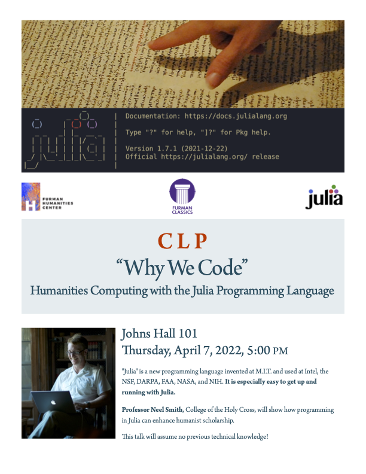

# Why we code: public lecture and weekend workshop

## Who

- anyone interested in how coding can provoke thinking about language and literature

## What

Overviews of what we'll do in each workshop session:

- some [basics for humanities research](./session1/)
- looking at the style of [Lincoln's Gettysburg Address](./session2/)
- comparing [translations of the Bible in multiple languages](./session3/)

