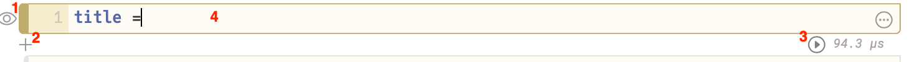

# Session 3: comparing translations of the Bible


## Overview


In our third workshop session, we will work primarily in Julia's new Pluto notebooks to explore patterns of language in different openly licensed translations of the Bible in multiple languages.  We will build an interactive tool for visualizing *n-grams* (sequences of `n` successive terms) in a text.  Questions we will address include:  how do n-grams reflect the structure and syntax of different languages? How do n-grams point us towards patterns in the translation of concepts in the source text?  Can we identify common features across languages?


## Coding concepts in this session

- Pluto notebooks: starting a server
- Pluto notebooks: organizing functions and objects in cells
- Pluto notebooks:  add user interaction with `PlutoUI` widgets
- grouping objects in collections

## Preparation for this session

- download a copy of [this repository](https://github.com/neelsmith/why_we_code) and find the `data/bibles` directory


## Pluto notebooks

### Starting a Pluto server

Open a Julia REPL, and at the `julia` prompt, enter these two expressions:

```
using Pluto
Pluto.run()
```

Once the server has started up, it will open a web page in your default browser, and you'll know you can use Pluto.  You can either work from an new notebook by following the "new notebook" link, or follow these steps to open a template notebook you can modify:


1. open [this web page](../notebooks/session3/session3nb.html)
2. click the button  "**Edit** or **run** this notebook" to download a template notebook to your computer
3. use the "Open from file" input box to open the downloaded file


### Working with Pluto notebooks





Pluto notebooks are composed of *cells*, like the one illustrated here.  Every cell in a Pluto notebook is in fact a Julia object! Recall that this means it has a *value*. Write a Julia expression in the body of the cell (**4** in the illustration) to define its value; use the arrow (**3**) to run the cell. The Pluto notebook server will display the value of the cell immediately above it. You can show or hide the Julia expression defining the cell's value using the "eye" icon to the left of the cell (**1** ).  To create an additional new cell, use the + icon (**2**).


## Review materials

Here's a completed solution to this session's notebook

- Pluto [notebook for session 3](../notebooks/session3/)

