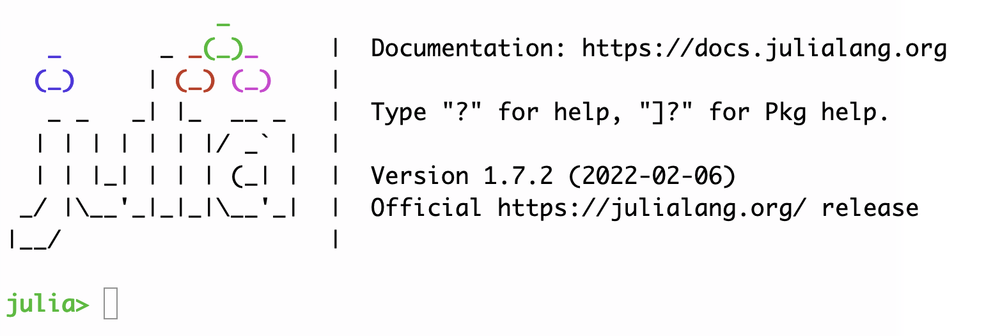

# Technical prerequisites

There are only two prerequisites for this workshop:

1. the [Julia language](https://julialang.org/downloads/).  Download and install the current stable release.
2. [Visual Studio Code](https://code.visualstudio.com/download). Download and install the current version for your OS. 

## Testing your Julia installation

 Find an icon that your Julia installation created that looks similar to this, and use it to open an interactive Julia terminal (or REPL).  If you  see a prompt like this one, you're running Julia!

Exit the REPL by typing `exit()` (followed by return).

## Configuring and testing your VS Code installation

Open Visual Studio Code.

On the left side of the window, you'll see a strip of icons. Click on the highlighted icon that looks like a block being fit into a grid. This lets you add extensions to VS Code. 

If you're on Mac OS, open VS Code, open the Command Palette (`Cmd+Shift+P`) and start typing 'shell command'.  When you see a listing like this !()[https://code.visualstudio.com/assets/docs/setup/mac/shell-command.png], choose `Install 'code' command in PATH`.

