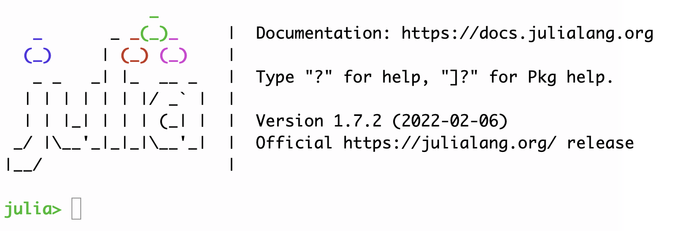
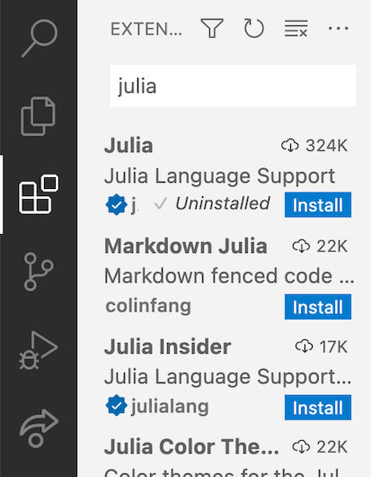

# Drop-in session: preflight checklist


On Friday, April 8, we will have a drop-in session where you can test that your personal machine is ready to go for all three workshop sessions.


## Testing your Julia installation

 Find an icon that your Julia installation created that looks similar to this, and use it to open an interactive Julia terminal (or REPL).  If you  see a prompt like this one, you're running Julia!




You can exit the REPL by typing `exit()` (followed by return).


## Adding and testing Julia packages


Open a Julia REPL.  Type `]` to enter package mode where you can add further packages to the core Julia languages. Because this is the first time you've used Julia, it will take some time for your system to download and compile everything, but it will be much faster to update or use packages you've already installed.

Don't worry about following the logic of these tests:  we'll learn in the first workshop session how to manage packages.  For this tuneup, we just want to make sure a few things are preinstalled and running correctly so we don't have to spend a lot of time just getting set up.  

At the `pkg>` prompt, paste in or type the following lines:

```
add CitableBase
add SplitApplyCombine
add PlotlyJS
add Pluto
```

When this (long) process is through we want to test each of the packages.  At the `pkg>` prompt, use the delete or backspace key to return to the `julia>` prompt.  Then try the following tests by copying and pasting the following commands. (Again, each will take some time the first time you actually use the package.)


```
using CitableBase
slidingwindow([1,2,3,4,5])
```

The final result of this command should look like 

```
 [1, 2]
 [2, 3]
 [3, 4]
 [4, 5]
```

```
using SplitApplyCombine
frost = """The woods are lovely dark and deep
But I have promises to keep
And miles to go before I sleep,
And miles to go before I sleep.
"""
group(split(frost))
```

The final result should be a list of 19 words in a "Dictionary" grouping together each repetition of the word.


```
using PlotlyJS
team = ["Rays", "Red Sox", "Yankees", "Blue Jays", "Orioles"]
wins2021 = [100, 92, 92, 91, 52]
Plot(bar(x = team, y  = wins2021))
```

Julia should try to open up a separate window to display the plotting result. In a perfect world, you should see a bar graph in a new window.

```
using Pluto
Pluto.run()
```

This should start a Pluto notebook server and open a new page in your default web browser.

To stop the notebook server, type Control-C.

To end your REPL session, type `exit()` followed by return.


## Configuring and testing your VS Code installation

Open Visual Studio Code.  It may look a little different from other text editors you're used to. You may want to watch this brief video (5 minutes) on getting famliar with VS code.


[](https://code.visualstudio.com/docs/introvideos/basics)


### The Julia plugin in VS Code

On the left side of the window, you'll see a strip of icons. Click on the  icon that looks like a block being fit into a grid (highlighted in the illustration below). This lets you add extensions to VS Code.   In the adjacent box, type `julia` (as illustrated here), then install the Julia extension ("Julia Language" Support) using the blue "Install" button.




Now let's test this:

1. from the File menu, choose "New Window"
2. in the new window, open a new folder (File menu, "Open Folder...", or the "Open..." link in the "Get Started" panel).  Create a new folder (maybe  named `testvscode`) someplace you can find it easily (maybe on your Desktop).
3. From the File menu, choose "New File".  In the new file, type or paste this:  `println("Hello there")`
4. Save the file in your new folder with the name `test.jl`.  Your first test is that VS Code should highlight the quoted text in a different color.
5. From the View menu, choose "Command Palette..." (or use the short cut `Cmd/Ctrl-Shift-P`, with `Cmd` on Mac OS, and `Ctrl` if you're on Windows or Linux).
6. At the Command Palette, start typing `Julia: Run File` until you see the choice `Run File in New Process`, and choose that option.  This should open a terminal at the bottom of your VS Code window, and run the Julia command -- you're running Julia inside VS Code!

